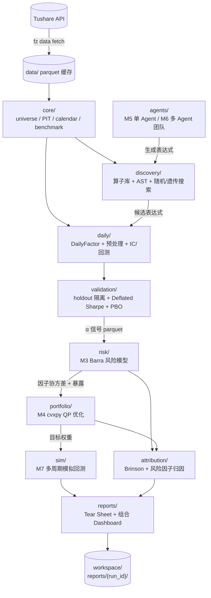

# 架构

> [FactorZen](../README.md) · [文档](README.md) · **架构** · [运行手册](runbook.md) · [路线图](evolution-plan-2026.md)

FactorZen 是端到端、可复现的 A 股量化研究平台。经 M0-M7 升级后，平台由**八层**构成：每层职责独立、产物落 manifest、接口稳定，层间只通过标准化 parquet / JSON 传递数据。

---

## 平台分层架构

```text
┌─────────────────────────────────────────────────────────────────────┐
│  AI 编排层 (agents/)                                                  │
│  M5 单 Agent 挖掘闭环 ←→ M6 多 Agent 团队（Hypothesis/Coder/         │
│  Critic/Librarian/Evaluator）+ 跨 session 长期记忆                    │
│  横跨因子层与评估层，通过 fz mine agent / fz mine team 驱动           │
└──────────────────────────────┬──────────────────────────────────────┘
                               │ LLM 生成表达式 / 反思迭代
┌──────────────────────────────▼──────────────────────────────────────┐
│  因子层 (daily/  discovery/)                                         │
│  M0 单因子研究链路：DailyFactor 基类 / PIT 上下文 / 预处理            │
│  M1 因子挖掘：算子库 + 表达式 AST↔字符串编译 + 随机/遗传搜索          │
└──────┬──────────────────────────────────────────────────────────────┘
       │ 因子值 parquet
┌──────▼──────────────────────────────────────────────────────────────┐
│  评估层 (daily/evaluation/  validation/)                             │
│  IC / 分层回测 / walk-forward / M2 防过拟合护栏                       │
│  block bootstrap CI + Deflated Sharpe + PBO/CSCV + holdout 永久隔离  │
└──────┬──────────────────────────────────────────────────────────────┘
       │ α 信号 parquet / 护栏通过标志
┌──────▼──────────────────────────────────────────────────────────────┐
│  风险层 (risk/)                                                       │
│  M3 Barra 风险模型：8 风格因子 + 行业因子暴露                          │
│  Newey-West 协方差 + 特质风险收缩 + MCR（边际风险贡献）分解            │
└──────┬──────────────────────────────────────────────────────────────┘
       │ 因子协方差矩阵 / 因子暴露矩阵
┌──────▼──────────────────────────────────────────────────────────────┐
│  组合层 (portfolio/  attribution/)                                   │
│  M4 cvxpy 因子形式 mean-variance QP                                   │
│  约束：box / budget / 行业风格中性 / 换手上限                          │
│  Brinson 归因 + 风险因子归因                                          │
└──────┬──────────────────────────────────────────────────────────────┘
       │ 目标权重 parquet + 归因报告
┌──────▼──────────────────────────────────────────────────────────────┐
│  执行层 (sim/)                                                        │
│  M7 多周期权重回测：对齐行情 / 扣换手成本 / 净值 / 夏普 / 最大回撤     │
└──────┬──────────────────────────────────────────────────────────────┘
       │ 净值序列 / 绩效指标
┌──────▼──────────────────────────────────────────────────────────────┐
│  展示层 (reports/)                                                    │
│  单因子 Tear Sheet HTML + M7 组合 Dashboard                           │
│  指标卡 + 净值曲线 + 月度热图 + 归因可视化 + 风险摘要                  │
└─────────────────────────────────────────────────────────────────────┘

基础：数据层 (core/  data/)
  universe 快照（M0）/ PIT 无未来函数 / benchmark / 日历 / Tushare 加载器
  M0 微观结构：停牌/涨跌停/ST/次新/T+1 交易约束内嵌于 universe 快照
```

---

## 端到端数据流



> 纯文本版数据流（不支持 mermaid 时）：
>
> ```text
> Tushare → data/ → core/(universe/PIT/benchmark)
>   ├─→ daily/(因子评估) ←── discovery/(表达式搜索) ←── agents/(LLM)
>   │        │
>   │   validation/(防过拟合护栏)
>   │        │ α 信号
>   ├─→ risk/(Barra 协方差) ──→ portfolio/(凸优化) ──→ attribution/(归因)
>   │                                  │
>   │                             sim/(模拟回测)
>   │                                  │
>   └─────────────────────────── reports/(Tear Sheet + Dashboard)
>                                      │
>                               workspace/reports/{run_id}/
> ```

---

## 模块职责表（M0-M7）

| 阶段 | 模块路径 | 职责 |
|------|----------|------|
| 基础 | `config/` | 集中路径、研究常量、Tushare 配置 |
| 基础 | `core/` | 日历、universe 快照、存储、加载、数据审计、配置校验、实验 manifest、计时与日志 |
| M0 | `core/universe.py` `core/benchmark.py` `daily/evaluation/backtest.py` | 停牌/涨跌停/ST/次新/T+1 交易约束、universe 快照（PIT）、性能基准对齐 |
| M0 基线 | `daily/` | 低频主线：PIT 数据上下文、因子基类、预处理、IC、回测、归因、成本与优化 |
| M1 | `discovery/` | 算子库（时序/截面/算术）+ 表达式 AST↔字符串双向编译 + 随机/遗传搜索 + 贪心去相关 |
| M2 | `validation/` | block bootstrap IC CI + Deflated Sharpe Ratio + PBO/CSCV + holdout 永久隔离、多重检验记账 |
| M3 | `risk/` | Barra 风格（8 因子）+ 行业因子暴露 + Newey-West 协方差 + 特质风险收缩 + MCR 分解 |
| M4 | `portfolio/` `attribution/` | cvxpy 因子形式 mean-variance QP（CLARABEL solver）、约束体系；Brinson + 风险因子归因 |
| M5 | `agents/` | LLM 闭环（假设→生成→护栏→critic→反思），零依赖自建 loop，Negative RAG |
| M6 | `agents/roles/` `agents/team_orchestrator.py` `agents/experiment_index.py` | 5 角色多 Agent 团队 + 跨轮否决 + 跨 session 长期记忆（`ExperimentIndex`） |
| M7 | `sim/` | 多周期权重回测：对齐行情、扣换手成本、净值序列、夏普、最大回撤 |
| M7 | `reports/portfolio_report.py` | 组合 HTML Dashboard：指标卡 + 净值曲线 + 月度热图 + 归因 + 风险摘要 |
| 基础 | `reports/` | 单因子 Tear Sheet 报告引擎、图表、评分、摘要与模板 |
| 基础 | `pipelines/` | `daily_single` 与 `generate_report` 端到端流程编排 |
| 基础 | `cli/` | 统一 `fz` 命令行入口 |

---

## 产物边界与 workspace 结构

```text
workspace/
  factors/{run_id}/
    manifest.json           # 配置 / git_sha / pixi.lock hash / 阶段耗时
    factor_values.parquet   # 因子值时间截面
    ic_series.parquet       # IC 时序
    backtest.parquet        # 分层回测
    report.html             # Tear Sheet（旧路径：factor_evaluations/）

  risk_models/{run_id}/
    manifest.json
    factor_exposures.parquet
    factor_cov.parquet
    specific_risk.parquet
    risk_report.html

  portfolios/{run_id}/
    manifest.json
    weights.parquet         # 目标权重（日频）
    attribution.parquet     # Brinson + 风险归因
    attribution_report.html

  sim/{run_id}/
    manifest.json
    nav.parquet             # 净值序列
    performance.json        # 夏普 / 最大回撤 / 年化收益

  reports/{run_id}/
    manifest.json
    portfolio_dashboard.html  # 组合 Dashboard（M7 展示）

data/                       # Tushare parquet 缓存（不提交 git）
```

每个 `run_id` 目录下必有 `manifest.json`，记录：配置 YAML、命令行参数、`git_sha`、`pixi.lock` hash、工作树 dirty 状态、各阶段耗时、输出路径、成功/失败状态。跨运行索引写入 `workspace/factor_evaluations/experiment_index.jsonl`，由 `fz runs list` / `fz runs show` 查询。

---

## 关键设计原则

### 1. PIT 无未来函数

所有因子计算、universe 过滤均使用 point-in-time 数据上下文（`daily/data/`）。财务数据按公告日对齐，不使用报告期末数据。M0 universe 快照在调仓前 T 日生成，确保停牌/涨跌停/ST 约束无穿越。

### 2. Holdout 永久隔离

M2 防过拟合护栏要求：
- 训练/验证期与 holdout（OOS）期严格分离，holdout 段在整个研究流程中**只用一次**（最终验收），不参与任何参数调优。
- 每次挖掘/搜索的 `trial_count`（多重检验次数）登记到 `ExperimentIndex`，用于 Deflated Sharpe 矫正。

### 3. 命名空间分离

| 命名空间 | 用途 |
|----------|------|
| `daily/optimization/` | 单因子研究流中的截面股票选择（IC 最大化） |
| `portfolio/` | 组合构建流：α 信号 + 风险模型 → 目标权重（QP 优化） |

两者接口不混用：`daily/` 产出的 `alpha_score` 文件作为 `portfolio/` 的输入，通过 parquet 解耦。

### 4. 可复现性

- 随机搜索、遗传算法均记录 seed，可从 manifest 完整复现。
- LLM Agent 调用记录 prompt/response（含 model id）到 `agents/logs/`，可复现推理路径。
- `pixi.lock` 锁定完整依赖树，确保跨机器一致。

### 5. agents/ 横跨因子层

AI 编排层（`agents/`）不直接写因子文件，而是通过 `discovery/` 的算子库和 AST 编译器生成表达式字符串，再走 M2 护栏评估。Agent 只读 `ExperimentIndex`（避免重复挖掘），不直接修改 `workspace/`。

---

## 明确非目标

- 不内置商业行情数据（需自行配置 Tushare token）。
- 提供组合优化 + 模拟交易闭环，但**不接实盘 OMS/EMS，不做实盘下单**。
- 不把 Tushare 网络请求放进默认 CI（CI 全用 mock）。
- 不把 `data/`、`workspace/` 的本地产物提交到仓库。
- 不把 `intraday/` 与 Tick 级研究作为当前主线。
