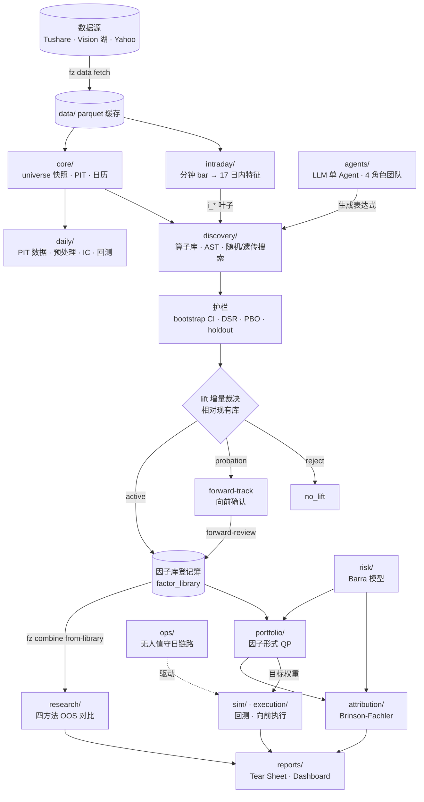

# 架构

> [FactorZen](../../README.md) · [文档](../README.md) · **架构**

平台约 49,500 行 Python，分成职责独立的子包。层间只通过 parquet / JSON 传递数据，每个环节落 `manifest.json`。

---

## 分层结构

```text
┌──────────────────────────────────────────────────────────────────┐
│  运营与展示                                                       │
│  ops/      无人值守 8 阶段日链路（幂等重入 + 告警）                │
│  reports/  Tear Sheet · 组合 Dashboard        server/  只读 API   │
└───────────────────────────┬──────────────────────────────────────┘
                            │ 净值 / 指标 / manifest
┌───────────────────────────▼──────────────────────────────────────┐
│  执行                                                             │
│  sim/        组合权重回测        execution/  向前执行（纸面撮合）  │
└───────────────────────────┬──────────────────────────────────────┘
                            │ 目标权重 parquet
┌───────────────────────────▼──────────────────────────────────────┐
│  风险与组合                                                       │
│  risk/        Barra 风险模型（A 股）                              │
│  portfolio/   因子形式 QP        attribution/  Brinson-Fachler    │
│  research/    多因子四方法 OOS 对比                               │
└───────────────────────────┬──────────────────────────────────────┘
                            │ 入库因子（active）
┌───────────────────────────▼──────────────────────────────────────┐
│  因子库与准入  ★ 平台裁决中枢                                     │
│  discovery/factor_library.py   唯一登记簿 · 四态状态机            │
│  discovery/lift_test.py        lift 增量裁决（单一裁决函数）      │
│  discovery/forward_track.py    向前确认                           │
└───────────────────────────┬──────────────────────────────────────┘
                            │ 候选因子 + 护栏证据
┌───────────────────────────▼──────────────────────────────────────┐
│  挖掘与验证                                                       │
│  discovery/   算子库 · 表达式 AST · 随机/遗传搜索 · 去相关 · 残差  │
│  agents/      LLM 单 Agent · 4 角色团队 + Evaluator               │
│  validation/  统计原语      discovery/guardrails.py  护栏咬合     │
└───────────────────────────┬──────────────────────────────────────┘
                            │ 因子面板 / 叶子特征
┌───────────────────────────▼──────────────────────────────────────┐
│  数据与因子基础                                                   │
│  core/      日历 · universe 逐日快照 · 加载缓存 · 叶子 schema      │
│  daily/     PIT 数据 · 预处理 · IC · 回测 · walk-forward           │
│  intraday/  分钟 bar → 日内微观结构特征面板（17 特征）             │
│  markets/   Ports & Adapters：ashare / crypto / futures / us      │
└──────────────────────────────────────────────────────────────────┘
```

与传统因子平台的结构差异在于**因子库层的位置**：它不是研究链路末端的一个归档目录，而是夹在「挖掘」与「组合」之间的准入闸门。所有候选因子必须穿过它才能进入下游，判据是相对现有库的增量。详见[因子库与增量准入](factor-library.md)。

---

## 端到端数据流



> 纯文本版（不支持 mermaid 时）：
>
> ```text
> 数据源 → data/ → core/(universe/PIT) + intraday/(日内特征)
>            ↓
>        discovery/(挖掘) ←── agents/(LLM 生成表达式)
>            ↓
>        护栏(bootstrap CI / DSR / PBO / holdout)
>            ↓
>        lift 增量裁决 ──active──→ 因子库登记簿
>            └──probation──→ forward-track → forward-review → 因子库
>            ↓
>        research/(组合研究) · portfolio/(QP) ←── risk/(Barra)
>            ↓
>        sim/ · execution/ ──→ reports/  （ops/ 每日驱动）
> ```

---

## 模块职责

| 子包 | 行数 | 职责 |
|---|---:|---|
| `discovery/` | 10,235 | 挖掘 + **因子库 + lift 准入**。全平台最大子包，迭代最密集 |
| `daily/` | ~5,900 | A 股日频主干：PIT 数据、预处理、IC、回测、walk-forward |
| `core/` | 4,843 | 日历、universe 逐日快照、Tushare 加载与缓存、叶子 schema 单一真源 |
| `agents/` | 4,654 | LLM 挖掘：单 Agent 闭环、4 角色团队 + Evaluator、实验索引 |
| `cli/` | — | 14 个顶层命令 / 45 个叶子命令 |
| `markets/` | 3,687 | Ports & Adapters，四市场适配 |
| `pipelines/` | 3,548 | 端到端编排：单因子链路、组合、research run |
| `intraday/` | 2,593 | 分钟 bar → 日内微观结构特征面板 |
| `risk/` | 1,737 | Barra 风险模型（仅 A 股） |
| `research/` | 1,669 | 多因子组合研究（四方法 OOS 对比） |
| `builtin_factors/` | 1,316 | 内置因子，随包分发 |
| `llm/` | 960 | LLM 客户端（双 profile） |
| `execution/` | 809 | 向前执行引擎（纸面撮合 + 分歧归因） |
| `reports/` | 768 | Tear Sheet + 组合 Dashboard 渲染 |
| `ops/` | 514 | 无人值守 8 阶段日链路 |
| `config/` | 494 | 配置模型与路径常量 |
| `strategies/` | 470 | 规则型策略实验（择时/轮动），**CLI 不可达** |
| `sim/` | 301 | 模拟交易（复用日频回测引擎） |
| `dataio/` | 260 | 数据迁移脚手架，由 `tools/` 脚本调用，**非运行时 IO 层** |
| `server/` | 207 | 只读 REST API + Web 页（dev extras） |
| `validation/` | 202 | 防过拟合**统计原语**（判定逻辑不在这里） |
| `portfolio/` | 121 | 因子形式 mean-variance QP |
| `attribution/` | 95 | Brinson-Fachler + 风险因子归因 |
| `experiments/` | 48 | run 产物目录布局工具，**与实验追踪无关** |

> ℹ️ **尺寸即信号。** `discovery/` 一个包超过全平台五分之一的代码量，`portfolio/` + `attribution/` 合起来只有 216 行。这如实反映了平台的能力权重：挖掘与准入侧成熟，组合优化侧偏薄。这不是「重实现藏在别处」——配对的 `daily/optimization/` 也只有 348 行。

三个包的名字容易误导，特别说明：

- **`validation/`** 只提供纯统计函数（DSR、PBO、bootstrap、holdout 切分）。真正的「护栏咬合 / `passed` 判定」在 `discovery/guardrails.py` 与 `discovery/scoring.py`。
- **`experiments/`** 是 48 行的文件命名工具，把产物按稳定文件名复制进 run 目录，跟实验管理没有关系。
- **`dataio/`** 是一次性数据迁移的库层，只被仓库根的 `tools/` 脚本调用，`src/` 内零引用。日常研究链路的数据 IO 在 `core/loader.py` 与 `markets/*/provider.py`。

---

## 需要成对修改的路径

以下配对是历史上最大的 bug 来源——**改任一侧必须检查另一侧**，新增第二路径必须加一致性测试。

| 路径 A | 路径 B | 共享的是什么 |
|---|---|---|
| `discovery/mining_session.py` | `agents/nodes.py` | 护栏判定、DSR 的 N、holdout 阈值 |
| `pipelines/daily_single.py` | `pipelines/generate_report.py` | 回测参数、前向收益口径 |
| `fz sim run`（`sim/`） | `fz live step`（`execution/drivers`） | 信号执行时点、成本口径 |
| `markets/crypto` ccxt provider | Vision 湖 provider（默认） | 叶子语义、end 边界、分页 |
| team session 末 lift 钩子 | `factor-library rebuild` 复审 · `lift-test --apply` | `lift_admission` 单一裁决 |
| A 股引擎默认参数 | crypto 参数注入 | 「参数化带 A 股默认值」，A 股零回归是底线 |

> ⚠️ `portfolio/`（因子形式 QP）与 `daily/optimization/`（全 Σ）是**故意分离的双路径，不要合并**。只有 optimizer status 口径需要一致。

回测的快慢双路径已于 2026-07 全面收敛为单一日环引擎（`daily/evaluation/backtest.py`）与单一约束核（`apply_trade_constraints_batch`），不再是双路径。

---

## 承重文件

改动以下文件需要走分支 + PR + CI：

| 文件 | 行数 | 为什么承重 |
|---|---:|---|
| `cli/main.py` | 2,791 | 全仓最大文件，所有命令的实现入口 |
| `discovery/factor_library.py` | 2,174 | 唯一登记簿，改动影响全部准入消费方 |
| `daily/evaluation/backtest.py` | 1,473 | 单一日环引擎，sim / factor backtest / live 共用 |
| `discovery/lift_test.py` | 1,358 | 单一准入裁决，三个消费方共用 |
| `agents/team_orchestrator.py` | 1,589 | 团队编排 + 末端 lift 钩子 |

---

## 产物边界

研究产出落 `workspace/`，行情数据与缓存落 `data/`，两者都不入库。每个 run 目录必有 `manifest.json`。完整布局与字段见[产物参考](../reference/artifacts.md)。

---

## 相关阅读

- [设计铁律](design-principles.md) —— PIT、护栏咬合、可复现的具体落地
- [因子库与增量准入](factor-library.md) —— 裁决中枢的详细机制
- [多市场适配](multi-market.md) —— Ports & Adapters 与四市场能力边界
- [CLI 参考](../reference/cli.md) —— 命令到模块的映射
